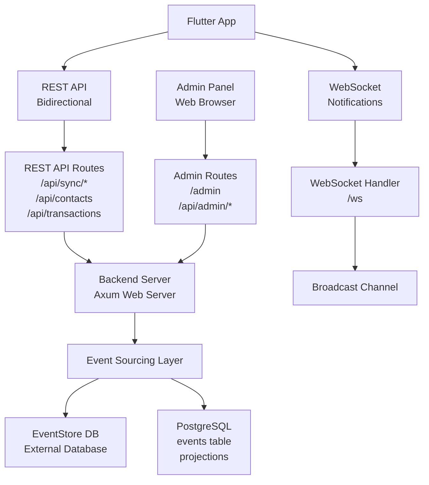
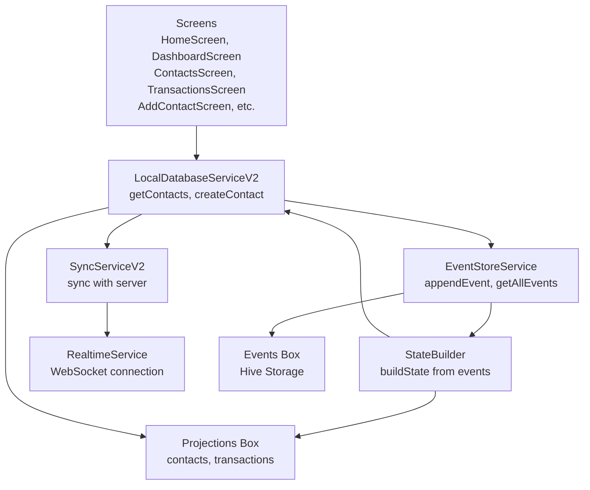

# Debt Tracker Architecture

## Overview

Debt Tracker is a debt management application with:
- **Local-first architecture**: Works offline, syncs when online
- **Event sourcing**: Complete audit trail with immutable events
- **Real-time sync**: Instant updates via WebSocket

**Tech Stack:**
- **Backend**: Rust (Axum web framework)
- **Frontend**: Flutter (Dart)
- **Database**: PostgreSQL (projections) + EventStore DB (events)
- **Real-time**: WebSocket with broadcast channels

---

## Application Flow

### User Creates a Contact

```
1. User fills form and taps "Save"
   ↓
2. Flutter App
   ├─ LocalDatabaseServiceV2.createContact()
   ├─ Creates event: CONTACT_CREATED
   ├─ Stores event in local Hive (EventStoreService)
   ├─ Rebuilds state from all events (StateBuilder)
   ├─ Updates local projections (contacts box)
   └─ UI updates immediately (instant feedback)
   ↓
3. Background Sync (SyncServiceV2)
   ├─ Detects unsynced event
   ├─ Sends event to server: POST /api/sync/events
   └─ Marks event as synced when accepted
   ↓
4. Backend Server (Rust)
   ├─ Receives event via sync endpoint
   ├─ Validates event
   ├─ Writes event to EventStore DB (immutable)
   ├─ Updates PostgreSQL projection (contacts_projection)
   ├─ Broadcasts change via WebSocket
   └─ Returns success to client
   ↓
5. WebSocket Broadcast
   ├─ All connected clients receive notification
   ├─ Clients trigger sync (SyncServiceV2.manualSync())
   ├─ Clients pull new events from server
   ├─ Clients rebuild local state
   └─ All UIs update automatically
```

### User Views Contacts

```
1. User opens contacts screen
   ↓
2. Flutter App
   ├─ Reads from local Hive box (contacts projection)
   ├─ No network call needed (instant)
   └─ Displays contacts immediately
   ↓
3. Background Sync (if online)
   ├─ Compares local hash vs server hash
   ├─ If different: pulls new events
   ├─ Rebuilds state from all events
   └─ UI updates if changes detected
```

### Real-Time Updates

```
1. User A creates a transaction
   ↓
2. Server processes and broadcasts via WebSocket
   ↓
3. User B's app receives WebSocket message
   ├─ Triggers immediate sync
   ├─ Pulls new events from server
   ├─ Rebuilds local state
   └─ UI updates automatically (no refresh needed)
```

---

## System Architecture

### High-Level Architecture



### Client Architecture (Flutter)



---

## Event Sourcing

### Core Concept

All changes are stored as **immutable events**. Current state is derived by replaying events.

**Benefits:**
- Complete audit trail (who did what, when, why)
- Time travel (reconstruct state at any point in time)
- No data loss (events are append-only)
- Conflict resolution (version tracking)

### Event Flow

```
User Action
  ↓
Create Event (CONTACT_CREATED, TRANSACTION_UPDATED, etc.)
  ↓
Store Event (EventStore DB / Local Hive)
  ↓
Rebuild State (from all events)
  ↓
Update Projections (PostgreSQL / Local Hive)
  ↓
Broadcast Change (WebSocket)
  ↓
All Clients Sync & Update
```

### Event Types

- `CONTACT_CREATED` - New contact added
- `CONTACT_UPDATED` - Contact modified
- `CONTACT_DELETED` - Contact deleted (soft delete)
- `TRANSACTION_CREATED` - New transaction added
- `TRANSACTION_UPDATED` - Transaction modified
- `TRANSACTION_DELETED` - Transaction deleted (soft delete)

### Event Structure

```json
{
  "id": "uuid",
  "aggregate_type": "contact" | "transaction",
  "aggregate_id": "uuid",
  "event_type": "CREATED" | "UPDATED" | "DELETED",
  "event_data": {
    "name": "John Doe",
    "phone": "+1234567890",
    "comment": "Added from mobile app"
  },
  "timestamp": "2026-01-18T00:00:00Z",
  "version": 1
}
```

---

## Backend-Frontend Communication

The Flutter app communicates with the backend through two distinct channels:

### REST API (Bidirectional Data Transfer)

**Purpose:** Send and receive events, sync data, make requests

**Client → Server (Send Data):**
- `POST /api/sync/events` - Send local events to server
- `POST /api/contacts` - Create contact (direct API, used by web)
- `POST /api/transactions` - Create transaction (direct API, used by web)
- `PUT /api/contacts/:id` - Update contact
- `DELETE /api/contacts/:id` - Delete contact

**Client ← Server (Receive Data):**
- `GET /api/sync/hash` - Get server event hash and count (for comparison)
- `GET /api/sync/events?since=<timestamp>` - Pull new events from server
- `GET /api/contacts` - Get contacts (used by web)
- `GET /api/transactions` - Get transactions (used by web)

**Flow:**
```
Client needs to sync
  ↓
Client calls GET /api/sync/hash (compare hashes)
  ↓
If different:
  ├─ Client calls GET /api/sync/events (pull new events)
  └─ Client calls POST /api/sync/events (push local events)
  ↓
Client rebuilds state from all events
```

### WebSocket (One-way Notification)

**Purpose:** Receive lightweight notifications when server has changes

**Server → Client (Notifications Only):**
- Server broadcasts notification: `{"type": "contact_created", "data": {...}}`
- Client receives notification and triggers sync via REST API
- Client then pulls actual events using `GET /api/sync/events`

**Flow:**
```
Server processes change
  ↓
Server writes event to EventStore DB
  ↓
Server updates PostgreSQL projection
  ↓
Server broadcasts notification via WebSocket
  ↓
All connected clients receive notification
  ↓
Clients trigger SyncServiceV2.manualSync()
  ↓
Clients use REST API to pull events (GET /api/sync/events)
  ↓
Clients rebuild state and update UI
```

**Why Two Channels?**
- **REST API**: Reliable bidirectional data transfer, handles large payloads, works with any HTTP client
- **WebSocket**: Lightweight notification to trigger sync immediately (no polling needed), reduces server load

---

## Data Synchronization

### Sync Strategy

**Hash-based comparison:**
1. Compare local event hash vs server event hash
2. If hashes match → already in sync
3. If different:
   - Pull new events from server (since last sync timestamp)
   - Push unsynced local events to server
   - Rebuild state from all events

**Benefits:**
- Efficient (only syncs differences)
- Handles offline gracefully
- Prevents duplicate events (idempotency)

### Sync Endpoints

- `GET /api/sync/hash` - Get server event hash and count
- `GET /api/sync/events?since=<timestamp>` - Get events since timestamp
- `POST /api/sync/events` - Send local events to server

### Conflict Resolution

- Server uses **version tracking** (optimistic locking)
- Conflicts detected by version mismatch
- Server rejects conflicting events
- Client handles conflicts (currently logged, merge strategy TODO)

---

## Real-Time Updates

### WebSocket Flow

```
1. Client connects to ws://localhost:8000/ws
   ↓
2. Server subscribes client to broadcast channel
   ↓
3. On data change:
   ├─ Server writes event to EventStore DB
   ├─ Server writes event to PostgreSQL events table
   ├─ Server updates PostgreSQL projection
   ├─ Server broadcasts notification: {"type": "contact_created", "data": {...}}
   └─ All connected clients receive notification
   ↓
4. Clients receive notification:
   ├─ RealtimeService._handleRealtimeUpdate() called
   ├─ Triggers SyncServiceV2.manualSync()
   ├─ SyncServiceV2 uses REST API (GET /api/sync/events) to pull events
   ├─ StateBuilder rebuilds state from events
   └─ UI updates automatically
```

**Note:** WebSocket only sends notifications. The actual event data is transferred via REST API.

### Implementation

**Backend (Rust):**
- File: `backend/rust-api/src/websocket.rs`
- Technology: Axum WebSocket with Tokio broadcast channels
- Broadcast channel: 100 message buffer

**Frontend (Flutter):**
- File: `mobile/lib/services/realtime_service.dart`
- Auto-connects on app start
- Auto-reconnects if connection drops (1-second delay)
- Triggers sync immediately on any WebSocket message

---

## Offline-First Architecture

### Mobile/Desktop (Local-First)

**Local-first:**
- All reads/writes happen on local Hive database first
- Instant UI updates (no network delay)
- Background sync when online
- Works fully offline

**Components:**
- **Hive**: Local NoSQL database
- **EventStoreService**: Stores events locally
- **StateBuilder**: Rebuilds state from events
- **SyncServiceV2**: Handles bidirectional sync

### Web (API-First)

**API-first:**
- Direct API calls (no local storage)
- Requires internet connection
- Real-time updates via WebSocket
- Sync happens via API endpoints

---

## Backend Architecture

**Important:** Both the Flutter client and the Admin Panel connect **directly** to the same Backend Server. They are separate clients and do not connect through each other.

The backend server consists of two distinct parts:

### Part 1: API Handling (REST API + WebSocket)

**Purpose:** Handle requests from Flutter clients (mobile/web/desktop)

**REST API Endpoints:**
- **Sync:**
  - `GET /api/sync/hash` - Get server event hash and count
  - `GET /api/sync/events` - Get events (with optional `since` parameter)
  - `POST /api/sync/events` - Send local events to server

- **Contacts:**
  - `POST /api/contacts` - Create contact
  - `PUT /api/contacts/:id` - Update contact
  - `DELETE /api/contacts/:id` - Delete contact

- **Transactions:**
  - `GET /api/transactions` - List transactions
  - `POST /api/transactions` - Create transaction
  - `PUT /api/transactions/:id` - Update transaction
  - `DELETE /api/transactions/:id` - Delete transaction

- **Other:**
  - `GET /api/settings` - Get user settings
  - `PUT /api/settings/:key` - Update setting
  - `POST /api/auth/login` - Authenticate user
  - `GET /health` - Health check

**WebSocket:**
- `WS /ws` - WebSocket connection for real-time notifications

### Part 2: Admin Page Serving

**Purpose:** Serve the web-based admin panel for monitoring and debugging

**Connection:** Admin panel (web browser) connects directly to the backend server (e.g., `http://localhost:8000/admin`)

**Admin Routes:**
- `GET /admin` - Serves HTML admin panel page (`static/admin/index.html`)
- `GET /api/admin/events` - List events (with filters)
- `GET /api/admin/contacts` - List all contacts
- `GET /api/admin/transactions` - List all transactions
- `GET /api/admin/projections/status` - Get projection status
- `POST /api/admin/projections/rebuild` - Rebuild projections
- `DELETE /api/admin/events/:event_id` - Delete event (undo)

**Access:** http://localhost:8000/admin

**Note:** The admin panel uses `/api/admin/*` endpoints, while Flutter clients use `/api/*` endpoints (without `/admin` prefix).

---

### HTTP Routes Summary

The backend exposes REST API endpoints organized by functionality:

*(See Part 1 and Part 2 sections above for complete endpoint listing)*

### WebSocket Handler

**Location:** `backend/rust-api/src/websocket.rs`

**Functionality:**
- Accepts WebSocket connections at `/ws` endpoint
- When a client connects, subscribes them to the broadcast channel
- Sends messages from the broadcast channel to the connected client
- Handles connection lifecycle (connect, disconnect, errors)

**Flow:**
```
Client connects to /ws
  ↓
WebSocket Handler accepts connection
  ↓
Subscribes client to broadcast channel
  ↓
Spawns tasks:
  - Send messages from channel → client
  - Receive messages from client (ping/pong)
  ↓
Client receives all broadcast messages
```

### Broadcast Channel

**Type:** Tokio broadcast channel (`broadcast::Sender<String>`)

**Functionality:**
- Created at server startup with 100 message buffer
- When data changes, handlers call `broadcast_change()` to send messages
- All connected WebSocket clients receive the message automatically
- Messages are JSON strings: `{"type": "contact_created", "data": {...}}`

**Usage:**
```rust
broadcast_change(&broadcast_tx, "contact_created", &json_data);
```

### Admin Panel

**Route:** `GET /admin`

**Functionality:**
- Serves HTML page from `backend/rust-api/static/admin/index.html`
- Web-based monitoring and debugging interface
- Features:
  - View events with filtering and search
  - View contacts and transactions
  - Monitor projection status
  - Rebuild projections
  - Delete recent events (undo functionality)

**Access:** http://localhost:8000/admin

### Request Handling Flow

```
HTTP Request
  ↓
Route Handler (contacts.rs, transactions.rs, sync.rs, admin.rs)
  ↓
Validate Request
  ↓
Write Event to EventStore DB
  ↓
Write Event to PostgreSQL events table
  ↓
Update PostgreSQL Projection
  ↓
Broadcast via Broadcast Channel
  ↓
Return Response
```

### Event Store (EventStore DB)

**Purpose:** External database for immutable event storage (write-only)

**Features:**
- Append-only (events never deleted or modified)
- Idempotency key support (prevents duplicates)
- Version tracking (optimistic locking)
- Complete audit trail
- Primary event store for the system

**Setup:**
```bash
./scripts/manage.sh start-services eventstore
```

**Access:**
- HTTP API: http://localhost:2113
- Web UI: http://localhost:2113 (admin/changeit)

### PostgreSQL Database

**Purpose:** Contains both event log and materialized projections

**Event Log:**
- `events` table - Stores all events (for debugging and querying)
- Indexed for fast queries by user, aggregate, type, timestamp
- Contains full event data in JSONB format

**Projections (Materialized Views):**
- `contacts_projection` - Current contact state (optimized for reads)
- `transactions_projection` - Current transaction state
- `users_projection` - User accounts
- `user_settings` - User preferences
- Automatically updated when events are written

**Why Both EventStore DB and PostgreSQL?**
- **EventStore DB**: Primary event store, optimized for append-only writes
- **PostgreSQL events table**: Queryable event log for debugging/admin
- **PostgreSQL projections**: Fast read-optimized views of current state

---

## Security

### Current State

- **Authentication**: Not yet implemented (planned: JWT tokens)
- **Authorization**: User-scoped data access (single user for now)
- **Event Store**: Idempotency prevents duplicate operations
- **Version Tracking**: Prevents concurrent modification conflicts

### Planned

- JWT token authentication
- Multi-user support
- Role-based access control
- Rate limiting

---

## Related Documentation

- [API Reference](./API.md) - Complete API endpoint documentation
- [Development Guide](./DEVELOPMENT.md) - Development setup and workflow
- [Deployment Guide](./DEPLOYMENT.md) - Production deployment instructions
